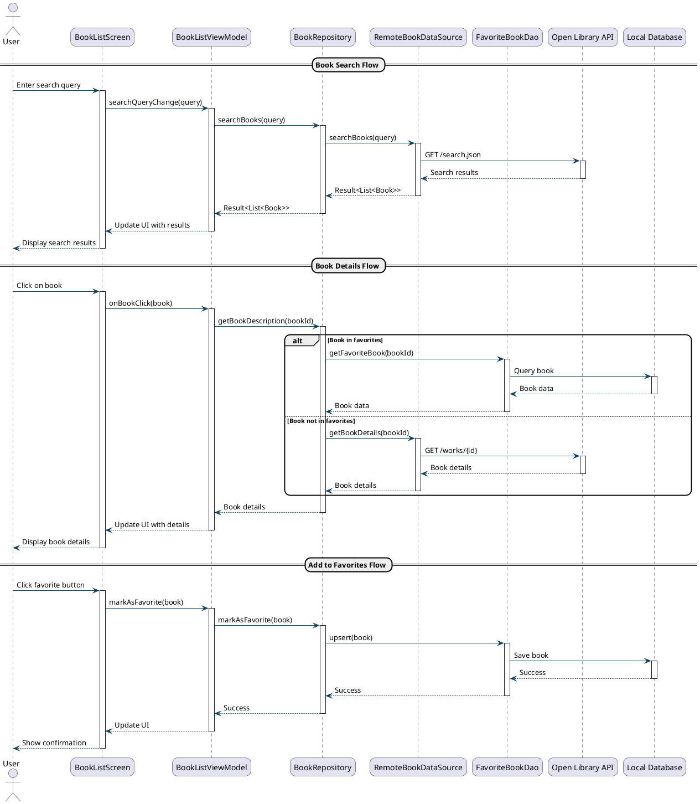

# BookNest 

BookNest is a modern, cross-platform book discovery and management application built with Kotlin Multiplatform and Jetpack Compose. It allows users to search for books, view details, and manage their favorite books across Android, iOS, and Desktop platforms.

## Demo 🎥

### Screenshots

#### Android


#### Desktop


### Key Features Demo

1. **Book Search**
   - Real-time search with Open Library API
   - Instant results with book covers
   - Smooth animations and transitions

2. **Book Details**
   - Comprehensive book information
   - Beautiful cover image display
   - Author information and publication details
   - Ratings and reviews
   - Add to favorites functionality

3. **Favorites Management**
   - Save books for offline access
   - Easy-to-use favorites interface
   - Quick access to saved books
   - Smooth animations when adding/removing favorites

## Features 

- **Cross-Platform**: Works on Android, iOS, and Desktop
- **Book Search**: Search for books using the Open Library API
- **Book Details**: View comprehensive book information including:
  - Cover images
  - Author information
  - Publication details
  - Ratings
  - Page count
  - Language
  - Synopsis
- **Favorites**: Save and manage your favorite books
- **Modern UI**: Beautiful Material 3 design with smooth animations
- **Offline Support**: Access your favorite books even without internet

## Tech Stack 

- **Kotlin Multiplatform**: For cross-platform development
- **Jetpack Compose**: For modern UI development
- **Ktor**: For network requests
- **Room**: For local database
- **Koin**: For dependency injection
- **Coil**: For image loading
- **Open Library API**: For book data

## Project Structure 📁

```
composeApp/
├── src/
│   ├── commonMain/          # Shared code
│   ├── androidMain/         # Android-specific code
│   ├── iosMain/            # iOS-specific code
│   └── desktopMain/        # Desktop-specific code
```

## Getting Started 🚀

### Prerequisites

- Android Studio Hedgehog or newer
- JDK 17 or newer
- For iOS development: macOS and Xcode
- For Desktop development: JDK 17

### Building the Project

1. Clone the repository:
```bash
git clone https://github.com/yourusername/BookNest.git
cd BookNest
```

2. Open the project in Android Studio

3. Build and run:

For Android:
```bash
./gradlew :composeApp:installDebug
```

For Desktop:
```bash
./gradlew :composeApp:run
```

For iOS (requires macOS):
```bash
./gradlew :composeApp:embedAndSignAppleFrameworkForXcode
```

## Architecture 🏗

The project follows Clean Architecture principles with the following layers:

- **Presentation**: UI components and ViewModels
- **Domain**: Business logic and use cases
- **Data**: Repository implementations and data sources
- **Core**: Common utilities and extensions

## Sequence Diagram

